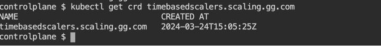
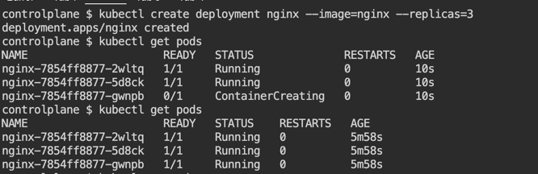
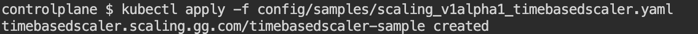

# kubeoperator-demo

Existing Operator : https://operatorhub.io/

Scale up or down the deployments based on time.

Requirement : Develop kubernetes operator SDK using the operator-SDK which scale up or down the deployment objects based on time.
And update the label of the deployment objects to know who updated the deployment configuration.
Also, update the custom resource object status to success or failure to know the status of the operation.

## Description

Reference : https://sdk.operatorframework.io/docs/building-operators/golang/tutorial/

API is in under api folder. Whenever we update the API, run `make generate` command and also `make manifests`
We can see the controller with Reconcile method inside internal where we should write our custom logic for the operator.
Sample CR is under /config/samples

## Getting Started
### Prerequisites
- go version v1.20.0+
- docker version 17.03+.
- kubectl version v1.11.3+.
- Access to a Kubernetes v1.11.3+ cluster.

### To Deploy on the cluster
**Build and push your image to the location specified by `IMG`:**

```sh
make docker-build docker-push IMG=<some-registry>/kubeoperator-demo:tag
```

**NOTE:** This image ought to be published in the personal registry you specified. 
And it is required to have access to pull the image from the working environment. 
Make sure you have the proper permission to the registry if the above commands don’t work.

**Deploy the Manager to the cluster with the image specified by `IMG`:**

```sh
make deploy IMG=<some-registry>/kubeoperator-demo:tag
```

> **NOTE**: If you encounter RBAC errors, you may need to grant yourself cluster-admin 
privileges or be logged in as admin.


### Demo steps with screenshots

1. Install the operator SDK in the cluster

```sh
make install
```

If we want to see the logs, run it via 

```sh
make install run
```

2. It creates the CRD (Custom Resource Defintion) in the cluster



3. Check do you have any deployments already, if not create one



4. Apply the CR



we can also apply all the CR which is in that folders by using below command

```sh
kubectl apply -k config/samples/
```


5. Check the deployment whether it scaled up or down as per the CR.

6. Delete the instance (CRs) from the cluster

```sh
kubectl delete -k config/samples/
```

7. Delete the API (CRD) from the cluster

```sh
make uninstall
```

8. Undeploy the controller from the cluster

```sh
make undeploy
```

To deploy operator from operator hub, you can find more information under each operator
eg: https://operatorhub.io/operator/istio


Note : Used https://killercoda.com/playgrounds/scenario/kubernetes to test this one.

To Update Golang Version in killercoda:
1. Remove the go : rm -rf /usr/local/go 
2. Check the infrastructure : hostnamectl
3. Download proper file for that infrastructure : wget https://go.dev/dl/<file name>
4. Extract the tar : tar -C /usr/local -xzf <file-name>

